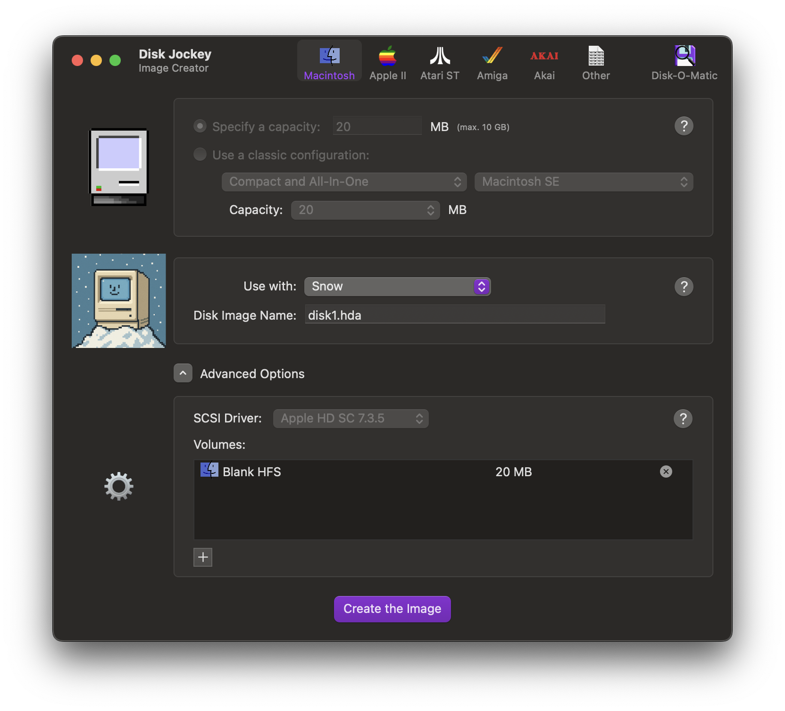
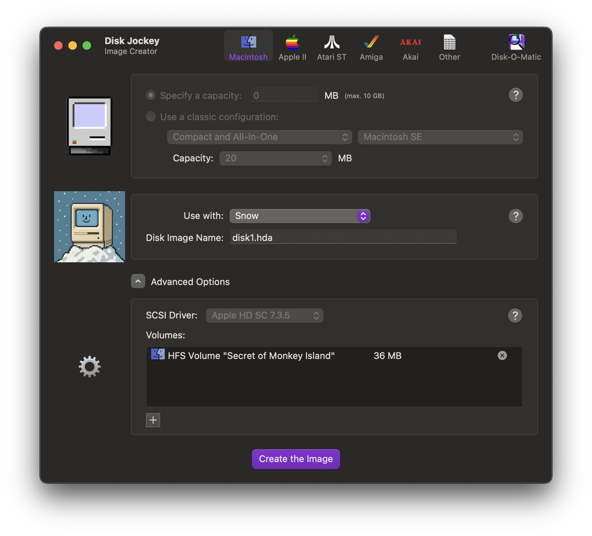

# Converting volume images

For hard drives, Snow uses 'device images' where other emulators, such as
Mini vMac, use 'volume images'. See [working with hard drives](../manual/media/harddrives.md)
for more information.

## Using Disk Jockey (MacOS/Windows)

[Disk Jockey](https://diskjockey.onegeekarmy.eu/) is an easy tool to, among
other things, convert a volume image to a device image. This guide explains
the steps to do a basic conversion.


After starting Disk Jockey, first select 'Snow' as the product to use the
new image with. If your version of Disk Jockey does not show 'Snow' in the
list, you can also choose 'BlueSCSI' as the image files are compatible.

You can change the filename of the new image in the 'Disk Image Name' field.



Then, click the 'X' next to the default 'Blank HFS' partition to delete it
and then click the '+' button to create a new partition.


Now, select 'Existing image...' from the dropdown and select the volume
image file in the file browser that appears.



You should see your volume appear, including the volume. You can create
more partitions on the same disk, if desired.

When you are finished, click 'Create the image' and save the image file to
the desired location. Your image file is now ready for use.
See [working with hard drives](../manual/media/harddrives.md) on how to
load the image file in Snow.

## Using Disk Jockey Jr. (MacOS/Linux)

[Disk Jockey Jr.](https://diskjockey.onegeekarmy.eu/djjr/) is a command line
tool from the same author that can convert volume images to device images.

To convert a volume image to a device image usable by Snow, run:

```
djjr convert to-device <input file.dsk> <output file.hda>
```

See [working with hard drives](../manual/media/harddrives.md) on how to
load the image file in Snow.
