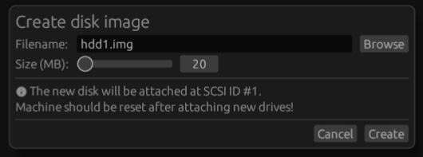

# Hard drives

Snow supports up to 7 SCSI hard drives in every emulated Macintosh model
except the Macintosh 128K/512K (as these models never included SCSI).

To perform actions on a specific SCSI HDD, go to 'Drives > SCSI #n' where
'n' is the SCSI ID of the drive (0 to 6).

## Creating a blank drive image

To create a blank hard drive image within Snow, use the 'Create new image...'
menu action. This will present the following dialog:

Browse to pick a filename and select the desired size and click 'Create'.

After creating a new disk, you must reset or restart the emulated system
for it to be recognized.

To initialize and use a new disk in the emulated system, use the MacOS
'HD SC Setup' tool. It is often found on the 'Disk Tools' floppy as part
of a MacOS floppy set. This floppy is bootable.

## Mounting an existing image

For hard drives, Snow uses 'device images'. These are images of an _entire_
hard drive from beginning to end, including the partition table, all the
partitions and the SCSI driver. Other emulators, such as Mini vMac, use
'volume images', which is an image of only a single HFS volume/partition.
Volume images are not compatible with Snow because they contain insufficient
data for the Mac to boot. If you want to convert a volume image to a device
image you can use in Snow, see [Converting volume images](../../guides/volume.md).

To mount an existing image file, use the 'Load disk image...' menu action
to browse for a disk image. Note that an image file must be a multiple of
512 bytes (the SCSI sector size) and must be an image of a full drive.

After mounting a disk, you must reset or restart the emulated system for
it to be recognized.

## Detaching a disk

To detach a mounted disk, use the 'Detach' menu action.

Note that this is the equivalent of pulling the cable on a hard drive so
if the disk is in use by the emulated operating system, it will likely
crash and/or damage the image. Shut down the emulated operating system
first.
